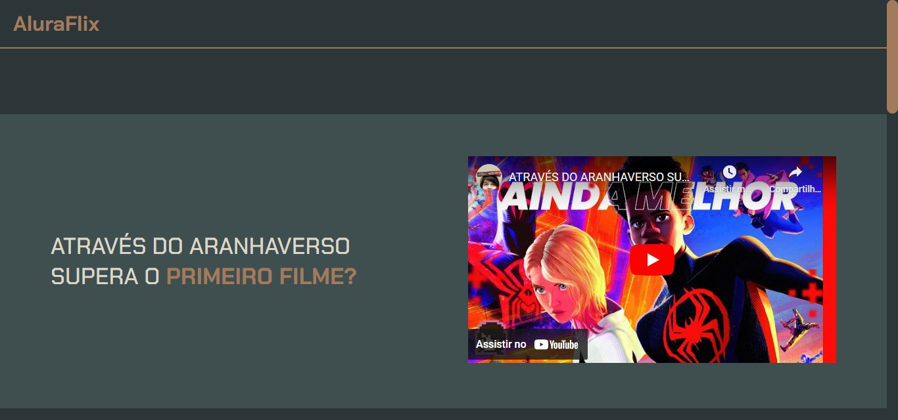
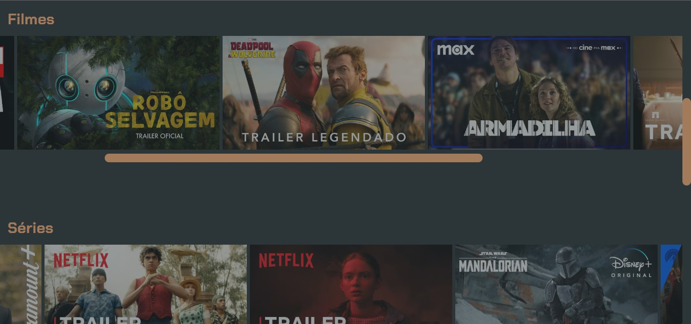
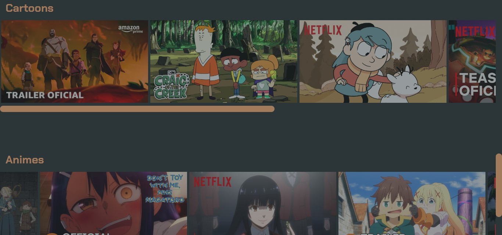

# AluraFlix

## Badges

## Bem-vindo! 👋
Obrigado por ver meu projeto!

## Descrição do projeto 😀
Esse projeto aborda sobre o AluraFlix, uma plataforma de streaming, feito com a ajuda da plataforma Alura.

## Como os usuários podem utilizá-lo?
Neste site, podemos encontrar o trailer de diversos filmes, séries, desenhos e cartoons.

## Tem algum feedback? 😁
Adoro receber feedbacks! Estou sempre buscando melhorar meus projetos. Então, se você tiver algo que gostaria de mencionar, envie um e-mail para evex12324@gmail.com!

## Tecnologias utilizadas
Foi utilizado no projeto o uso de Imagens, Links, Âncoras e Hover.

## Contribuidores
Alura, Mikannn e Plataformas de streaming

## Autor do projeto.
Pedro de Carvalho

**Compartilhe este repositório!** 🚀
